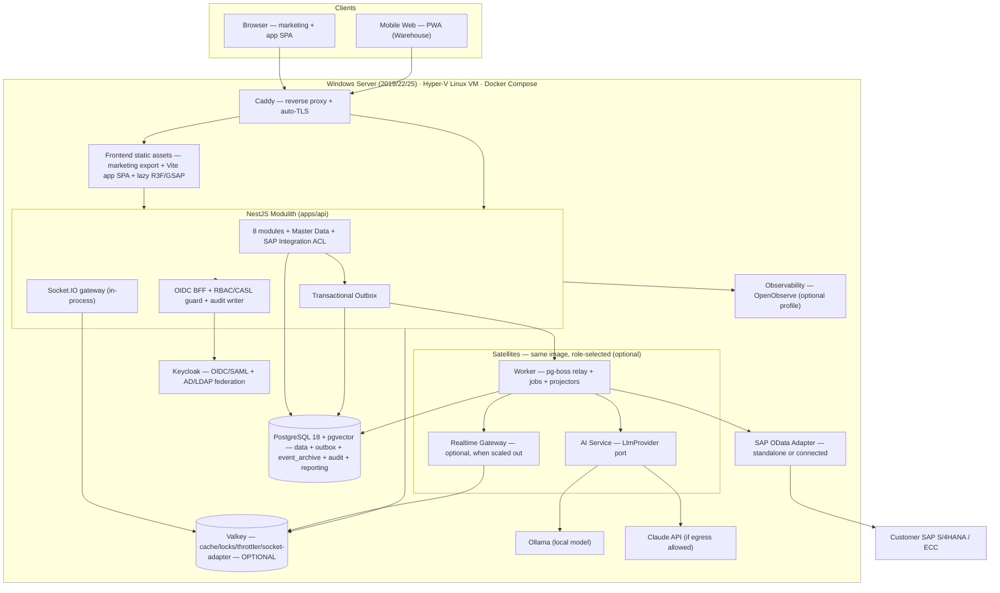
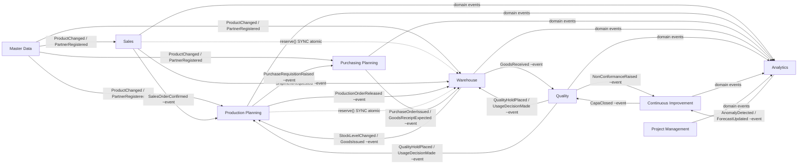

# ERP Platform — Architecture & Tech-Stack Design

> ⚠️ **SUPERSEDED (2026-07-16)** by [`2026-07-16-erp-ai-native-system-design.md`](2026-07-16-erp-ai-native-system-design.md). The user provided substantial new requirements (AI-native with multi-provider Claude/OpenAI/local models and agentic propose→approve→execute automation; polyglot TS+Python; scale to ~1,500–3,000 concurrent; a real SAP push+poll sync engine; a downloadable VM appliance with a remote vendor-update channel; a 4–8 dev team; and a revised 9-module list incl. S&OP). This document is retained for history only — read the v2 spec instead.

- **Date:** 2026-07-15
- **Status:** SUPERSEDED by the 2026-07-16 v2 spec
- **Authors:** Design derived from a 14-dimension, adversarially-reviewed architecture workflow (design → verify → consistency → completeness)
- **Scope of this document:** The **foundational platform architecture and technology stack** — the skeleton every functional module plugs into. Each of the 8 functional modules gets its own spec → plan → build cycle later. This document is NOT a per-module functional spec.

---

## 1. Context & fixed constraints

A greenfield, web-based, mobile-responsive **ERP platform**. It must run fully **standalone** or **integrated with SAP via OData**. Eight functional modules: **Quality, Continuous Improvement, Production Planning, Sales, Warehouse, Purchasing Planning, Analytics, Project Management.**

Decided facts that anchor every choice below:

| Dimension | Decision |
|---|---|
| Team | **Solo / 1–3 developers.** Operational simplicity is paramount; anything needing a dedicated ops/data team is disqualified. |
| Backend language | **TypeScript / Node** (Node 24 LTS). |
| Architecture style | **Modular monolith ("modulith")** that peels off a small, fixed set of satellite processes later **without a rewrite**. Full microservices explicitly rejected. |
| Deployment target | **On-prem first, single-tenant** (one install per customer), **Windows Server**, fully **Dockerized**; cloud later; **multi-tenant-ready without a rewrite**. |
| Scale | **Medium** (hundreds to low-thousands of concurrent users per install); design primitives that scale up, do not over-engineer for hyperscale. |
| Frontend | React-based, **best-in-class/interactive**: an award-caliber (Awwwards/FWA) landing page using a 3D + animation toolkit (React Three Fiber, GSAP/ScrollTrigger, Motion, Lenis) **and** a polished, data-dense responsive app UI. |
| SAP | **Optional, pluggable adapter** — never a hard dependency. |
| AI | Pluggable provider (**Claude API** cloud, or **local Ollama** for air-gapped); AI planning, AI NL-querying, AI analytics. |
| Non-functionals | Correctness & data integrity first; uptime; low operational burden; current/verified library versions; security; **immutable audit trail**; accessibility (WCAG AA, keyboard, `prefers-reduced-motion`); observability (logs, metrics, tracing, error tracking). |

### Decisions recorded this session (were close calls)
- **ORM = Drizzle** (SQL-first, engine-less, clean Row-Level-Security control).
- **Frontend delivery = static-export marketing + Vite React SPA**, served as static files by Caddy; NestJS is the single backend process.
- **Real-time transport (v1) = Socket.IO / WebSockets**, in-process on NestJS.

---

## 2. The architectural spine: a transactional outbox

The single idea that makes this architecture coherent and cheap to operate:

> **Every state change writes its domain event to an outbox table in the same database transaction as the business data.**

That one mechanism is simultaneously:
- the **event bus** between modules,
- the **async contract** across bounded contexts,
- the **audit feed** (the durable `event_archive` event log; the *compliance* audit is written in-transaction, not relay-projected — see §6),
- the **analytics projection** source,
- the **SAP write-back** path,
- the **real-time push** source, and
- the **modulith → satellite seam**.

Because it is just a PostgreSQL table drained by a Postgres-native job runner (**pg-boss**), there is **no Kafka / RabbitMQ / NATS** and **no mandatory Redis** at v1. Fan-out is done by the relay enqueuing one pg-boss job per subscribed consumer queue. A separate, **never-pruned `event_archive`** table is the durable replay/audit log (pg-boss's transient job table is not an event store).

**Satellites are the same Docker image** booted with a different role entrypoint (`WORKER_ROLE`, `AI_ROLE`, `REALTIME_ROLE`). Promoting a satellite is a **config/topology change, not a code rewrite**, precisely because all cross-satellite communication already flows through the outbox.

---

## 3. Reference architecture

### Container topology
- **App-plane core (always on): 4 containers** — PostgreSQL, Keycloak, NestJS app (`apps/api`), Caddy.
- **Kernel infra services (on by default — required for a functioning ERP):** `minio` + `clamav` (file/attachment storage + AV scan) and `gotenberg` (HTML→PDF for invoices/packing slips). So a **functioning kernel is ~7 containers**, not 4; the 4-container figure is the app plane only.
- **Optional Docker Compose profiles** (switched on per customer/scale): `worker`, `ai-local` (Ollama), `realtime-gateway`, `valkey`, `sap`, `observability` (OpenObserve), `error-tracking` (GlitchTip) — see §8.
- **Frontend** ships as static assets served by Caddy — **no long-lived Node SSR process**.
- **The outbox relay + pg-boss consumers run in-process inside `apps/api` by default.** In the diagram above they appear in the "satellites" box for clarity, but the `worker` profile only *moves* them to a separate container for scale — it is **never required for the outbox to drain**. A minimal (~7-container) install drains the outbox in-process; notifications, real-time push, audit archive, and analytics projection all work without any satellite.

---

## 4. The resolved, version-pinned stack

All versions pinned once in **pnpm catalogs** (satisfies the "pin versions" project rule). Re-verify exact patch versions at implementation time via the Context7 MCP.

| Concern | Choice |
|---|---|
| Language / runtime | TypeScript 6.0 (→ 7.0 fast-follow when tooling lands), **Node 24 LTS** |
| Monorepo | **pnpm workspaces + catalogs** (defer Turborepo until build times hurt) |
| Backend framework | **NestJS 11.1.x** modulith (plan a v12 migration when it GAs) |
| Module-boundary enforcement | **dependency-cruiser 18** + public-API port interfaces + Husky/lint-staged pre-commit |
| API contract | shared `packages/contracts` in **Zod 4** → `nestjs-zod` validation → OpenAPI emitted from the same schemas → `openapi-typescript` typed client. **No ts-rest** on the critical path (under-maintained; revisit after its 4.0). |
| Database | **PostgreSQL 18 + pgvector**, ONE instance, one (or a few) schema(s) with **real foreign keys** |
| ORM | **Drizzle** (0.45.x now; v1 GA as a scheduled, tested migration) |
| Eventing / jobs | transactional **outbox** + **pg-boss 10** (Postgres-native, no Redis) + append-only `event_archive`; orchestrated **sagas** with state in Postgres |
| Real-time | **Socket.IO 4.8.x** in-process on NestJS + **REST resync endpoint** (authoritative recovery). Redis/Valkey `@socket.io/redis-streams-adapter` added only when scaled to >1 node. |
| Auth (authN) | **Keycloak 26.6.x** — OIDC/SAML + AD/LDAP federation, MFA; NestJS is the OIDC **BFF** issuing an encrypted httpOnly session cookie |
| Auth (authZ) | **CASL** in-app policy engine; **Postgres RLS** as datastore backstop (enforced on the AI read-only role from day one; global enforcement flipped on for the SaaS path) |
| JWT/JWKS | **jose v6** (`createRemoteJWKSet`); drop `jwks-rsa` and Passport |
| AI | **Vercel AI SDK v7** behind an `LlmProvider` port; Ollama-local / Claude-cloud gated by `DATA_EGRESS`; RAG on **pgvector** (text only); ONE local **ONNX embedding** model (BGE-M3/E5); planning = **deterministic MRP** + closed-form heuristics (MILP solver deferred behind a port); **curated read-only tool registry** (no free-form text-to-SQL by default); human-in-the-loop on any AI-driven write |
| Frontend — marketing | **static export** (Astro islands or Next `output: export`) with R3F/GSAP/Motion/Lenis, route-scoped + lazy-loaded, `prefers-reduced-motion` + low-GPU fallback |
| Frontend — app | **Vite React SPA** (React 19), TanStack Router/Query/Table + Virtual, shadcn/ui + Radix + Tailwind v4, react-hook-form + zod (shared schemas), Zustand, next-intl/i18next, ECharts (+ Recharts for simple charts) |
| Observability | pino (JSON logs) + OpenTelemetry (traces + W3C context) + prom-client `/metrics`; **OpenObserve** single binary as the default backend (optional profile); GlitchTip deferred; append-only **hash-chained audit** table (per-aggregate chains) |
| Deployment | **Hyper-V Linux VM appliance** on Windows Server 2019/2022/2025, Docker Compose, **Caddy** auto-TLS, **Inno Setup** installer + **WinSW** service, **pgBackRest** PITR, **Ed25519** offline license (no phone-home), `docker save/load` air-gapped delivery |
| Testing / CI | **Vitest** + **Testcontainers** (real Postgres) + shared **adapter contract-suite** + thin **Playwright** E2E + **axe** a11y gate + **CWV budget** gate + Trivy/gitleaks; **k6 on-demand** (not a maintained gate pre-launch) |

---

## 5. Bounded contexts & module map

Ten bounded contexts: the 8 functional modules plus two platform contexts — **Master Data** (canonical products/partners/UoM/BOMs) and **SAP Integration** (anti-corruption layer).

> **Legend:** solid `~event` edges are **asynchronous domain events** (outbox → saga-orchestrated workflow progression); dotted `SYNC atomic` edges are **synchronous, in-transaction port calls** for strong invariants that must not tolerate eventual consistency — chiefly **stock reservation**, which decrements `available` atomically or fails, so Sales/Production can never oversell what the Warehouse holds (per rule 4 above and §6 Concurrency & reservation). Master Data reads (not drawn) are likewise synchronous port calls.

### Inter-module communication rules (enforced by dependency-cruiser)
1. A module **may not** import another module's services/entities/internals.
2. A module **may not** read another module's tables directly.
3. Modules interact **only** through: (a) a per-module **public-API port** barrel (`index.ts` exposing interfaces/DTOs) called synchronously via DI, or (b) **domain events** through the transactional outbox.
4. **Choose the mechanism by the nature of the interaction** (this is the single most load-bearing rule; it avoids both a distributed monolith and a falsely-synchronous one):
   - **Cross-module reads** (needing another context's current data, e.g. a Master Data lookup) → **synchronous public-API port call** (+ real FKs for integrity). Default for reads.
   - **A strong invariant that must not tolerate eventual consistency** (e.g. **stock reservation / oversell prevention**) → executed **atomically within a single transaction**, via a synchronous port call that performs the reservation in-transaction (e.g. Sales calls an inventory `reserve()` port that atomically decrements `available` or fails). **Never** an async request/confirm round-trip.
   - **Asynchronous business-workflow progression** across contexts over time (the ERP lifecycle: `SalesOrderConfirmed` → Production → Purchasing → Warehouse → Quality) → **domain events via the outbox**, coordinated by **orchestrated sagas** (process managers). These steps are genuinely separate units of work at different times, not one transaction — event-driven is correct here.
   - **Fire-and-forget notifications** and the **three technical satellite seams** (worker, AI, realtime gateway) → **domain events via the outbox**.
5. `domain/` may not import `infrastructure/`. Each module is a vertical slice: `api/ → application/ → domain/ → infrastructure/`.
6. The **only** future out-of-process splits are the three technical satellites (worker, AI, realtime gateway). **The 8 business modules never become services.**

Each module folder is generated from a **scaffolding generator** so all contexts stay structurally identical.

---

## 6. The platform kernel — build this BEFORE the 8 modules

The most important finding of the design: the modules share a foundation that, if retrofitted, forces the exact rewrite we are avoiding. Build the **kernel** first.

| Kernel capability | What & why |
|---|---|
| **Tenancy seam** | `tenant_id NOT NULL` (default single tenant) on every tenant-scoped table; a repository base class auto-applies the tenant filter; RLS policies **written but DISABLED** behind an `RLS_ENFORCE` flag. Cheap now; a rewrite later. CI cross-tenant isolation tests from day one. |
| **Migrations + boot gate** | One tool (**drizzle-kit**), **forward-only, expand/contract** migrations so old and new code tolerate the interim schema (enables rollback). Record `schema_version` in-DB with a boot-time compatibility gate. Automatic pre-upgrade backup + post-upgrade healthcheck. |
| **Master Data** | Sole owner of products, partners, plants, warehouses, BOMs, UoM, cost centers — referenced by ID from transactional modules. Exposed to modules via a **synchronous read port**. Phase-2 ships it **local-authoritative** with a **config seam** for per-entity source-of-truth policy; the SAP-authoritative policy matrix + reconciliation/dead-letter view are built **with the SAP integration** (deferred — see §8.4), not in the standalone kernel. |
| **Gapless number ranges** | `number_ranges` table (key, prefix pattern, current value, fiscal-year scope); allocation via `SELECT … FOR UPDATE` inside the document-insert transaction for legally gapless series (invoices/orders). Fast cached sequences only for non-legal internal IDs. Must not collide with SAP ranges when connected. |
| **Audit trail** | Append-only, **per-aggregate hash-chained** compliance table — the audit row **commits in the SAME transaction as the business change** (not async-projected by the relay), capturing actor/tenant/correlationId from the RBAC request context, action, entity, before/after. `UPDATE/DELETE/TRUNCATE` revoked on the table; a `BEFORE UPDATE/DELETE` trigger raises; chain-signing under a separate role. A DB-side `AFTER`-trigger diff capture + `pgaudit` (see §8.1) are a **complementary defense-in-depth layer**, not the primary compliance record. |
| **Config + feature flags** | DB-backed typed (Zod-validated) settings with per-tenant overrides, hot-reloadable, cached. Gates module visibility, business rules, and integration toggles. Every "optional/pluggable" promise resolves to a flag, not a code branch. |
| **Money & UoM kernel** | `Money` = bigint **minor units** + **always an ISO currency code** + a **configurable minor-unit exponent** (4–5 dp unit prices, FX). Single-currency installs are simply a subset, so the kernel contract holds regardless of the multi-currency answer; the only open question (§10) is whether v1 needs multi-currency **conversion/rates**. `Quantity` uses a UoM conversion registry seeded from Master Data. Frontend, DTOs, analytics facts, AI cards all import these — **never raw floats**. |
| **Fiscal calendar + period lock** | Period definitions with open/closed state; lock enforcement on transactional writes (no backdating into closed periods); business-day/holiday calendar for planning lead-times and SLAs. Distinct posting-date vs document-date; UTC storage + per-user timezone display. |
| **Notifications + approvals** | One notification service, pluggable channels: in-app center (Postgres + real-time push), email via configurable **on-prem SMTP** relay (nodemailer + MJML), optional SMS. One **configurable approval/workflow engine** (table-driven state machine, not BPMN) with delegation, escalation, SLA — driven by the event core. |
| **Files + documents + printing** | **MinIO** (S3-compatible) behind a storage port + **ClamAV** scan on upload; **Gotenberg**/headless-Chromium for HTML→PDF (invoices, packing slips); raw **ZPL/EPL** label generation POSTed to network printers (port 9100) + a small print-agent for USB/driver printers. Versioned, per-customer-overridable templates. |
| **Bulk import/export** | Async pipeline: upload → streaming XLSX/CSV parse → Zod validate → **dry-run preview with per-row errors** → commit as a background job; streamed exports (Postgres `COPY` / ExcelJS). Progress surfaced via real-time push. |
| **Concurrency & reservation** | **Optimistic locking** version columns with a 409/merge UX on grids; stock modeled as `available = on-hand − reserved` with atomic reservation on order confirmation (prevents Sales↔Warehouse oversell). Core, tested domain invariants. |
| **Global search** | Postgres full-text search (`tsvector` + GIN). No separate search cluster at this scale. |
| **Installer + watchdog** | One-command Compose bootstrap with pre-flight checks; first-run admin/tenant/seed wizard; Docker healthchecks + a watchdog that emails the local admin on container failure, low disk, backup failure, or license expiry — the "ops team you don't have." |
| **Licensing** | Signed (public-key-verified, **offline**) license file encoding tenant, enabled modules, seat count, expiry; checked at boot, gates feature flags; telemetry off by default. |
| **Public API + webhooks** | Versioned `/api/public` with **service-account API keys** (scoped, separate from human OIDC); signed outbound webhooks with retry/backoff via pg-boss; **rate limiting** (app-layer `@nestjs/throttler`, Redis-backed when >1 instance); idempotency-key header. |
| **AI governance** | PII/field allow-listing + redaction before any cloud call; per-tenant token/cost budgets with hard caps; prompt/response audit logging; semantic caching; graceful degradation / Ollama fallback; cloud-vs-local as a per-customer policy defaulting to local for air-gapped. |
| **Seed + demo data** | One idempotent seeder: default tenant, Keycloak realm/roles/permissions, a coherent cross-module demo dataset (a sales order flowing through production → purchasing → warehouse → quality), and sample dashboards. Makes the UI demoable on a fresh install and gives Playwright/k6 realistic fixtures. |

---

## 7. Cross-cutting standards

- **Canonical `DomainEvent` envelope** in `@erp/kernel`, used everywhere: `{ eventId (UUIDv7), type, version, occurredAt, tenantId, aggregateId, correlationId, causationId, actor, payload }`. Outbox rows, pg-boss jobs, audit rows, Socket.IO frames, analytics projectors, and OTel trace baggage all key off this single shape — a Sales-order-to-Purchasing flow is one correlated trace end to end.
- **Event naming/versioning:** past-tense PascalCase (`SalesOrderConfirmed`), publisher-owned, additive-only versioning (v1/v2 coexist), Zod-schema'd in `packages/contracts`; consumer-driven contract tests fail CI on any breaking change.
- **Single typed config module** (Zod-validated, fails fast at boot). Optionality flags: `INTEGRATION_MODE=standalone|sap`, `DATA_EGRESS=allow|deny`, `WORKER_ROLE`/`AI_ROLE`/`REALTIME_ROLE`, per-module license entitlements, `RLS_ENFORCE`.
- **Ordering:** per-aggregate order via an explicit per-aggregate version/sequence column; same-aggregate work routed through a single-concurrency queue keyed by `aggregateId`. Global order is never guaranteed; outbox drain order protects against loss, not reordering.
- **Idempotency:** deterministic `jobId` + a `processed_messages` table (TTL-pruned to the max replay window).

---

## 8. Component detail

### 8.1 Data layer
- ONE PostgreSQL 18 + pgvector; **Drizzle** ORM; a single bounded in-process `pg` pool per Node process (raise `max_connections` to ~200–300). **No PgBouncer at v1** — add only under measured connection pressure.
- Shared schema with real cross-context FKs; per-module DB **roles + GRANTs** as cheap defense-in-depth for the satellite thesis.
- **Complementary** (defense-in-depth, not the primary compliance record — that is the app-written hash-chained table in §6): DB-side `AFTER`-trigger old/new diff capture + `pgaudit` for DDL/privileged access.
- Backups: **pgBackRest** (PITR, encrypted repo) + nightly `pg_dump`; a **rehearsed restore drill on the real Windows target is a go-live gate**. Set RPO/RTO targets per customer (baseline: **RPO ≤ 5 min** via continuous WAL archiving, **RTO ≤ 4 h**).

### 8.2 Eventing, jobs & workflows
- Transactional outbox drained by pg-boss; relay fans out one job per subscribed consumer queue; **one engine, one DLQ, one idempotency model, one dashboard (Bull Board/pg-boss admin, admin-auth-gated, actions audited)**.
- Cross-module flows (Sales → Production → Warehouse → Purchasing) are **orchestrated sagas** (central process managers), state in Postgres.
- Repeatable schedulers (nightly MRP, SAP polling, KPI rollups) registered idempotently on worker boot so a broker wipe re-creates them from code.
- The relay is deliberately **single-active** (leader-elected) with restart-resume semantics; give it a dedicated non-pooled connection if using `LISTEN/NOTIFY` (or rely on a 1–5s poll).

### 8.3 Real-time (Socket.IO — chosen)
- Socket.IO 4.8.x mounted as an in-process NestJS gateway, driven **exclusively by domain events** from the outbox; room membership assigned server-side from RBAC/tenant claims.
- **REST resync endpoint** keyed by per-resource monotonic version is the **authoritative recovery path** (connection-state-recovery only for short blips).
- **Socket auth lifecycle:** JWT handshake + periodic token re-validation over the connection + server-pushed force-disconnect/re-scope on RBAC/role change, wired to the same policy guard as REST.
- Keep HTTP long-polling fallback enabled; document the **IIS ARR / reverse-proxy WebSocket-upgrade** config per install. Single-node v1 needs **no Redis**; add `@socket.io/redis-streams-adapter` + Valkey (AOF on, MAXLEN trimming, separate logical DB) when scaling to >1 node or splitting the gateway satellite.

### 8.4 SAP integration (optional/pluggable)
- One **anti-corruption layer** as an `Integration` bounded context exposing an `ErpSyncPort` with two config-selected implementations: a **StandaloneAdapter** (no-op; local Postgres is system-of-record) and a **SapODataAdapter** on the SAP Cloud SDK for JavaScript (odata-v2 + v4), local-destination mode, **no BTP/Cloud Connector** dependency.
- **v1 scope = READ-ONLY inbound master-data mirroring** for a small fixed entity set (materials, customers, vendors, BOMs) via timestamp high-watermark polling. Write-back, delta tokens, reconciliation reports, per-entity flag matrix, and auto-fallback are **deferred until a real SAP customer needs them (YAGNI)**.
- **Outbound** (when built) via **outbox-event subscription**, not injected port methods — so standalone mode has provably zero ERP coupling in domain code.
- SAP writes are **idempotent** (stable external key + query-before-post / Idempotency-Key header); ambiguous timeouts on a create route to **dead-letter for human decision — never auto-retry a create**. Per-message SAP response persisted to an append-only integration audit table.
- The SAP adapter authenticates to SAP with its **own least-privilege technical user** (BasicAuth default; OAuth2 client-creds for S/4 Cloud) from the secret store — **not** end-user identity pass-through (principal propagation deferred).

### 8.5 Auth & authZ
- **Keycloak** owns authN/SSO and federates the customer directory (AD/LDAP/SAML); NestJS is the OIDC **BFF** holding the session in an encrypted httpOnly cookie; satellites validate short-lived JWTs via JWKS (`jose` `createRemoteJWKSet`).
- **CASL** enforces fine-grained RBAC (+ABAC) in-process from the app's own Postgres permission model (roles, per-module/action permissions, record-level scoping). **Postgres RLS** is the datastore backstop — **enforced on the AI read-only role from day one**, global enforcement flipped on for SaaS.
- Multi-tenant path = **Keycloak 26 Organizations** (single realm), not realm-per-tenant. Server-side session/refresh store (Postgres) from day one. Custom **WCAG-AA login/MFA/reset theme** is an explicit deliverable.
- Full access audit trail (Keycloak events export + the app audit log).

### 8.6 AI layer
- One `AiModule` behind a hexagonal `LlmProvider` port; default adapter = **Vercel AI SDK v7** over cloud Claude / local Ollama, selected by `DATA_EGRESS`.
- **Planning v1 = deterministic** MRP arithmetic (BOM explosion, requirement netting, lead-time offset) + closed-form heuristics (reorder point, EOQ, single-item Wagner-Whitin). A MILP solver (HiGHS-WASM) is opt-in behind a solver port when a real multi-constraint problem is confirmed.
- **NL querying = curated semantic-layer + read-only allow-listed tool-calling**, NOT free-form text-to-SQL. If free-form SELECT ships at all, it runs against a dedicated read-only role with `statement_timeout`, forced `LIMIT`, RLS, and an AST allow-list — as defense-in-depth, not the primary gate.
- RAG on pgvector serves **text/documents only**; **every numeric value comes from a live parameterized query** (stored with the card for reproducibility). Numbers never come from embeddings.
- ONE local ONNX embedding model (BGE-M3/E5) for both cloud and air-gapped installs (single vector space). MCP server deferred — the same in-process tool registry is exposed to agents only when a concrete external-agent requirement exists.
- **Human-in-the-loop** on any AI/solver output that mutates ERP state: persist model/prompt/solver version + input-snapshot hash + approving user + timestamp as an immutable record before the write.
- Prefer running **Ollama natively on the Windows host** for reliable GPU access; publish a minimum VRAM baseline; CPU-only fallback documented. AI features in air-gapped mode are best-effort/async through the worker with admission control.

### 8.7 Frontend
- **Marketing** = static export (Astro islands or Next `output: export`) — full R3F/GSAP/Motion/Lenis, route-scoped and lazy-loaded away from the app core; `prefers-reduced-motion` static reveal + low-GPU fallback. Satisfies SEO + LCP<2.5s with no SSR runtime.
- **App** = Vite React SPA: TanStack Router + Query + Table + Virtual; shadcn/ui + Radix + Tailwind v4; react-hook-form + zod (schemas shared with the backend); Zustand for client state; next-intl/i18next (ICU) + multi-currency/UoM formatting; ECharts for analytics.
- Auth is enforced by the API on every request; SPA-side route gating is **cosmetic capability-gating only**.
- **Accessibility is a Definition-of-Done gate on every surface**: virtualized grids use `role=grid` + `aria-rowcount/colcount` + `aria-rowindex/colindex` + roving focus + a non-virtualized AT fallback; streaming AI panels use `aria-live=polite` + static reveal under reduced-motion; automated axe/Playwright checks + Lighthouse CWV budget (LCP<2.5s, INP<200ms, CLS<0.1) as failing CI gates. Warehouse screens are a barcode-friendly **PWA** (Serwist) with optimistic local queueing + sync-on-reconnect.

### 8.8 Observability & audit
- Instrument once: **pino** JSON logs, **OpenTelemetry** traces + W3C context propagation + log/trace correlation, **prom-client** `/metrics` scraped directly (drop OTel metrics export).
- Default backend = **OpenObserve** single binary (optional profile); full Grafana LGTM is an opt-in large-tier. Error tracking = **GlitchTip** pointed at a separate DB in the same Postgres (deferred until a customer forbids SaaS Sentry).
- The **compliance audit log is separate from operational telemetry** — durable, append-only, hash-chained in Postgres, in the backup set. Telemetry ingest/scrape endpoints sit behind the reverse proxy with auth/mTLS; no anonymous access.

### 8.9 Deployment (on-prem Windows)
- **Hyper-V Linux VM appliance** (stock Debian/Ubuntu LTS + Docker Engine + the Compose stack) running the identical Linux-container bundle. Works on Server 2019/2022/2025 (2025 recommended, not required). **Not** Docker Desktop; **not** WSL2 in production; **not** Windows containers.
- Windows installer (**Inno Setup**) imports/registers the VM, sets auto-start, port-forwards to **Caddy** (auto-TLS: internal CA for LAN, ACME with real DNS). A single **WinSW** Windows Service supervises the stack with a health-gated restart loop.
- PGDATA, pgBackRest repos, and secrets on native **ext4 with 0600 perms** — never a Windows bind mount. Secrets via Docker secrets / restricted env files; integration credentials encrypted at rest with an app master key; documented rotation.
- **Upgrades** = image-tag swap gated by an automatic pre-upgrade pgBackRest backup + a one-shot idempotent forward-only migration job + post-upgrade healthcheck; **rollback** = redeploy previous digest-pinned tags + restore. **Air-gapped** delivery via `docker save`/`docker load` of digest-pinned images. Resource-sizing guidance published.

### 8.10 Analytics & reporting
- **Postgres-only v1:** Tier 0 (direct OLTP lists) + Tier 1 (denormalized **reporting read models** projected from outbox events) + Tier 2 (a few `CONCURRENTLY`-refreshed matviews). Scheduling/exports via pg-boss; streaming exports via Postgres `COPY` / ExcelJS. Charts via one accessible ECharts theme wrapper. AI analytics grounded on a TypeScript **metric registry** with RLS on the read-only role.
- **DuckDB / ClickHouse / read-replica all deferred** — reintroduce embedded DuckDB (library-only, Parquet-snapshot path, behind the reporting-repository seam) only when a measured OLAP/export bottleneck appears. Per-KPI denormalized summary tables now; full star schema/SCD-2 added incrementally. `tenant_id` on all fact tables now. Export/report access is audit-logged.

### 8.11 Testing & CI
- Vitest single runner (unit + integration); integration hits a **real Postgres via Testcontainers** with **TRUNCATE-and-reseed** between tests (rollback-per-test banned for anything touching transactions/outbox/isolation).
- ONE shared **port-contract suite** run against both the standalone and SAP-OData adapters; the standalone-never-breaks guarantee comes from **dependency-cruiser forbidding any SAP-adapter import in the standalone build** (tested), not from a no-op passing the suite.
- Thin Playwright E2E over ~8–12 critical flows; **axe** a11y gate; **CWV** budget gate; **Trivy** + **gitleaks** + `pnpm audit`/OSV security gates; an **audit-trail test** asserting every mutating handler writes an audit row in the same transaction. **k6 on-demand** pre-release, not a maintained gate.
- Coverage: **100% on domain/money/state-machine logic**, ~70–80% on module services, **no line-coverage mandate on UI/glue** — buy safety with contract + flow tests.
- **Split pipelines:** fast PR (typecheck → Biome + type-checked typescript-eslint `no-floating-promises`/`no-misused-promises` → unit → integration → migration-drift → thin Playwright smoke → dep-audit + secret scan) vs slow merge/release (full E2E, container build on a Windows self-hosted runner, k6, axe, Lighthouse). Pin GitHub Actions to commit SHAs.

### 8.12 Security & compliance
- Postgres **RLS + least-privilege roles** as the enforcement floor (also makes future multi-tenant safe by construction); default-deny posture; a mandatory automated **cross-tenant isolation test** in CI; audit any `BYPASSRLS` grants.
- TLS everywhere (Caddy terminator, `verify-full` to Postgres). At rest: BitLocker for powered-off/theft only; **application-level AES-256-GCM** field encryption (keys via SOPS+age) is the real at-rest control for PII/secrets, with a documented threat model.
- AI text-to-SQL path locked behind the read-only role + curated views + RLS + `statement_timeout` + `LIMIT`.
- GDPR erasure via **crypto-shredding** (audit rows store pseudonyms/subject references or per-subject-encrypted payloads), with explicit legal sign-off on which record types (if any) need physical deletion.

---

## 9. Build order (roadmap)

Each phase is a later spec → plan → build cycle of its own.

1. **Repo & platform skeleton** — pnpm workspaces + catalogs, NestJS modulith scaffold, dependency-cruiser boundaries, `@erp/kernel` (DomainEvent envelope, Money/Quantity), Drizzle + migrations + `schema_version` gate, typed config + feature flags, Docker Compose (Postgres, Keycloak, api, Caddy), CI pipelines, seed/demo framework.
2. **Platform kernel** (§6) — tenancy/RLS-ready, audit, number ranges, Master Data, notifications + approvals, files/PDF/labels, import/export, concurrency+reservation primitives, global search, outbox + pg-boss + event_archive, Socket.IO gateway + resync, auth (Keycloak + CASL + RLS backstop), observability, installer + watchdog + backup/DR + licensing. *This is large for a 1–3 dev team; its own plan will sub-sequence it — foundation first (tenancy, audit, config/flags, outbox, migrations, auth), then the operational services (approvals, labels/PDF, bulk import, search) — rather than one monolithic build. It is front-loaded because retrofitting any of it is the rewrite we are avoiding.*
3. **First functional module** (chosen with you) — a full vertical slice proving the pattern end-to-end (recommendation: a self-contained module such as **Quality** or **Warehouse** that exercises master data, events, real-time, and printing without deep cross-module choreography).
4. **Remaining modules**, ordered by the dependency map (Master Data → Sales/Production/Purchasing/Warehouse core loop → Quality/CI → Project Management → Analytics read models).
5. **AI layer** and **SAP integration** layered on once the domain events they consume exist.
6. **Cloud / multi-tenant flip** — enable RLS enforcement, Keycloak Organizations, sharded tenancy — when the business case arrives.

---

## 10. Deferred (YAGNI) & open questions

**Deliberately deferred:** SAP write-back / delta tokens / reconciliation reports; MILP solver; standalone MCP server; free-form text-to-SQL; DuckDB/ClickHouse/read-replica; PgBouncer; Redis/Valkey; realtime-gateway satellite; multi-tenant enforcement; k6 as a CI gate; GlitchTip.

**Open questions for you:**
- Which functional module to build **first** after the kernel?
- Does any v1 customer need **multi-currency conversion/rates** (not just a currency code, which `Money` always carries)? Drives whether the FX rate table + rounding rules ship in v1.
- Air-gapped AI: is there a customer that forbids cloud egress in v1 (drives whether we harden the Ollama path early)?
- Any regulated-industry compliance regime (e.g., FDA 21 CFR Part 11, ISO 13485) that raises the audit/e-signature bar?
- Expected data-retention / archival horizon (drives partitioning strategy).
- Marketing static-export tooling — **Astro islands** vs **Next `output: export`** — to close at the marketing-page phase (not on the phase-1/2 critical path).

---

## 11. Key risks

| Risk | Mitigation |
|---|---|
| Modulith erodes into a big ball of mud | dependency-cruiser boundary gates in CI + pre-commit from commit #1; public-API ports; scaffolding generator |
| On-prem upgrades brick a customer with no dev on site | forward-only expand/contract migrations; `schema_version` boot gate; auto pre-upgrade backup + healthcheck; digest-pinned rollback |
| Windows container durability (fsync/WAL) | Hyper-V Linux VM (real Linux semantics); rehearsed backup+restore drill as a go-live gate |
| AI leaks rows a user can't see | RLS-enforced read-only AI role + curated tool registry + PII redaction + human-in-loop writes |
| Socket.IO WebSocket upgrade blocked by customer proxy/IIS | long-polling fallback on; documented IIS ARR upgrade config; REST resync as authoritative recovery |
| Library churn / stale versions | pnpm catalogs single-point pinning; Context7 re-verification at implementation time; scheduled framework-migration budgets (NestJS 12, TS 7, Drizzle v1) |
| Solo-team operational overload | minimal always-on footprint (~7 containers incl. files/PDF); worker/AI/realtime/observability/SAP all optional profiles; single-binary observability; watchdog as the "ops team you don't have" |

---

## 12. Appendix — feature-flag surface

`INTEGRATION_MODE` (`standalone`|`sap`) · `DATA_EGRESS` (`allow`|`deny`) · `RLS_ENFORCE` (`off`|`on`) · `WORKER_ROLE` / `AI_ROLE` / `REALTIME_ROLE` (entrypoint selectors) · per-module license entitlements · per-customer module visibility & business-rule toggles.
