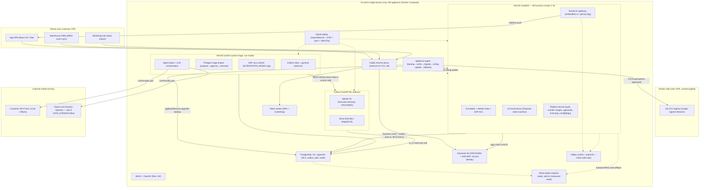
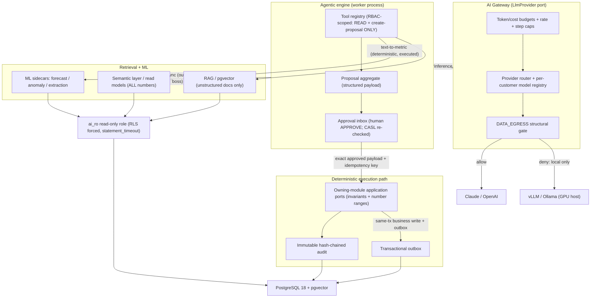
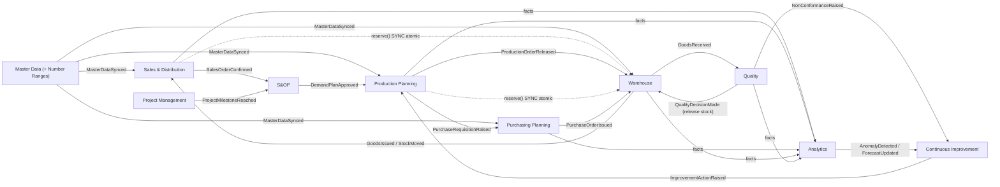

# AI-Native ERP — System Design & Architecture (v2)

- **Date:** 2026-07-16
- **Status:** Approved (design); pending spec review → user review → implementation planning
- **Supersedes:** `2026-07-15-erp-platform-architecture-design.md`
- **Method:** Derived from a 15-dimension multi-agent design workflow (design → adversarial verify → cross-dimension consistency → completeness critic), all version-checked as of 2026-07-16. Every choice below is the *post-adversarial-review* position; the review consistently pruned complexity.
- **Scope:** The **system design, architecture, and tech stack** — the platform skeleton, the AI plane, and the correctness core that every module plugs into. The 9 functional modules each get their own spec → plan → build cycle later. Not a per-module functional spec.

---

## 1. Context & fixed constraints

A greenfield, web-based, mobile-responsive, **AI-native ERP**. Runs fully **standalone** or **connected to SAP** (chosen per customer at onboarding). Delivered as a **downloadable on-prem appliance**; cloud later.

| Dimension | Decision (locked with the user) |
|---|---|
| **Modules (9)** | Sales & Distribution → S&OP → Production Planning → Purchasing Planning → Warehouse → Quality → Continuous Improvement → Analytics → Project Management. Plus platform contexts: **Master Data**, **SAP Integration (ACL)**, **AI-Governance**. |
| **Team** | 4–8 developers. Can sustain a few processes + per-squad ownership, but **not** full microservices for an on-prem product. |
| **Scale** | ~200–300 concurrent now (500–1,000 employees) → **~1,500–3,000 concurrent** (5,000–10,000 employees). ONE install per customer; scale up (vertical + horizontal) without a rewrite. |
| **Backend** | **TypeScript / NestJS modulith** core + **Python FastAPI ML sidecars** where ML libraries require it. |
| **AI** | **First-class, cross-cutting plane.** Autonomy = **propose → human approve → execute**, fully audited. **Multi-provider** (Claude **and** OpenAI **and** local open-source Llama/Qwen), selected per customer via a `DATA_EGRESS` gate. Local-model customers provide a GPU host. All four capability areas in scope: NL analytics, AI planning/optimization, agentic workflow automation, predictive + document AI. |
| **SAP** | Optional, chosen at onboarding. Adapter flexes across **S/4HANA & ECC**; sync engine supports **both push & poll**. **SAP owns master data + number ranges when connected**; we own them standalone. |
| **Deployment** | Prebuilt **Hyper-V/VMware Linux VM appliance** (Docker) on Windows Server; customer IT installs; **vendor pushes updates remotely over the customer VPN with consent** (+ offline path); accessed/activated via internal VPN URL. Multi-tenant-**ready** without a rewrite. |
| **Real-time** | Live dashboards + push notifications + shop-floor status + **offline-capable warehouse scanning**. No live collaborative co-editing in v1. |
| **Also required** | RBAC auth, event-driven, cron + workers, logs/analytics/error-tracking, DB management, correctness & data-integrity first, immutable audit, WCAG AA. |
| **v2 decisions** | ORM **Drizzle**; frontend **static marketing + Vite SPA**; realtime **Socket.IO**; marketing landing scope **decided at the marketing-page phase**; first module **Sales & Distribution**. |

---

## 2. Architectural shape: "modulith + a few satellites, one versioned appliance"

The entire system is **one NestJS codebase** deployed as **3 application tiers (4 app containers)** on a single Linux VM, anchored by a **transactional outbox in PostgreSQL**. The outbox is simultaneously the event bus, the async cross-context contract, the audit feed, the analytics projection source, the SAP sync path, the real-time push source, and the seam a process peels along.

**AI is woven in as internal modules — not a separate service.** This is the single most important structural decision: because the AI-Governance context lives *inside* the modulith, an approved AI action's `execute` step commits **in the same database transaction** as the business write and its audit row. An external AI service could not give that guarantee.

### 2.1 Process topology (v1 = 3 application tiers / 4 app containers + infra)

> The **ML tier is two containers** (`tabular-ml` + `docai`), so "3 tiers" = 4 app containers: API, Worker, and the two thin Python sidecars. Infra (Postgres, Keycloak, Caddy, MinIO+ClamAV, observability) is off-the-shelf single binaries.

| Process | Contents |
|---|---|
| **API** (NestJS modulith, scale 2..N stateless) | 9 modules + Master Data + SAP-ACL + AI-Governance contexts + the platform kernel + Socket.IO gateway (embedded). |
| **Worker** (same image, run-mode) | Outbox relay + pg-boss jobs/cron + the Postgres-backed **saga engine** (propose→approve→execute + business sagas) + SAP sync worker (`INTEGRATION_MODE=sap`) + agent loops / LLM orchestration. Isolated named queues + concurrency caps. |
| **ML sidecars** (Python FastAPI) | **`tabular-ml`** (forecast + anomaly; StatsForecast/MLForecast/PyOD/LightGBM/ONNX, CPU-first) and **`docai`** (Docling + RapidOCR). Split on the real dependency seam, not by business workload. |

**Infra containers:** PostgreSQL 18 + pgvector · Keycloak 26 · Caddy · MinIO + ClamAV · observability (OpenObserve + GlitchTip).
**Optional / scale profiles:** Valkey (cache + Socket.IO pub/sub — **multi-node only**) · read replica (measured fast-follow) · realtime-gateway split (deploy flag on same image).
**External:** customer **GPU host** running vLLM/Ollama; cloud LLM (Claude/OpenAI) **only if `DATA_EGRESS=allow`**.

> **Splitting rule:** processes split by **runtime / lifecycle / scaling axis, never by domain ownership.** The realtime gateway and SAP worker become their own processes only on a *measured* trigger; the 9 business modules never become services.

### 2.2 Reference architecture

---

## 3. The AI plane

### 3.1 The five AI-safety invariants (non-negotiable)
1. **Zero AI write scope.** The AI principal uses a read-only `ai_ro` DB role (RLS forced, `statement_timeout`, row caps) **plus a single `create-proposal` capability** — it can never mutate money/stock/master-data directly.
2. **Numbers come only from deterministic, executed, RLS-scoped queries** (governed semantic layer / validated read-only text-to-SQL with mandatory `LIMIT` + timeout). The LLM translates the question and narrates the result set; **it never computes or infers figures**, and RAG/embeddings are retrieval-only, never a source of numbers.
3. **Execute-time re-validation.** `execute` consumes the *exact approved structured payload*, re-checks CASL + RLS + domain invariants, and re-acquires ATP/stock/credit **inside the execution transaction** with an optimistic aggregate-version guard. Stale/invalid proposals fail and re-queue for a human — never force-apply. Idempotent via idempotency key (pg-boss is at-least-once).
4. **Untrusted content.** All extracted document/email text and retrieved RAG chunks are treated as **data, delimited, never instructions**; they cannot expand the agent's tool allowlist. Low-confidence and all money-bearing extracted fields force human review with the source artifact shown.
5. **Structural egress + cost control.** `DATA_EGRESS=deny` makes the provider router **refuse to construct** any cloud client (enforced additionally at the VM firewall); hard per-request max-tokens, per-customer/day spend caps, rate limits, and max agent-step bounds; breach = block + alert + audit.

### 3.2 Gateway, agentic engine, ML
- **LlmProvider port** (Vercel AI SDK v7 — native tool-approval + WorkflowAgent primitives): per-customer model registry, cross-provider fallback, budgets. Providers: **vLLM** (GPU, OpenAI-compatible) for local at the higher concurrency tier; **Ollama** for CPU/small/dev; **Claude/OpenAI** when egress allowed.
- **Planning** = deterministic MRP arithmetic + closed-form heuristics as the source of numbers; the LLM proposes plan structure/narrative and cites the deterministic figures. MILP solver deferred behind a port.
- **ML sidecars** classical-first (StatsForecast/MLForecast/PyOD on CPU via ONNX); model registry = a **Postgres table + filesystem artifacts under pgBackRest** (no MLflow); GPU sized for the LLM only; deep/VLM tier requires a second GPU. Per-customer retraining deferred to v2 (ship sane global models).

---

## 4. The resolved stack (versions verified 2026-07-16; re-verify via Context7 at scaffold)

| Concern | Choice |
|---|---|
| Language / runtime | TypeScript 6.x, **Node 24 LTS**; Python 3.12 (uv) for sidecars |
| Monorepo | pnpm workspaces + catalogs (Turborepo optional until CI wall-clock hurts) |
| Backend | **NestJS 11.1.28** modulith; dependency-cruiser 18 boundaries; nestjs-cls transactional wrapper |
| Contracts | **Zod 4** → nestjs-zod → OpenAPI → openapi-typescript (TS client) + datamodel-code-generator (Pydantic); CI drift-diff. REST+OpenAPI (no tRPC/GraphQL/ts-rest) |
| Database | **PostgreSQL 18 + pgvector ≥0.8.2**, ONE primary; **Drizzle 0.45.2** (hold 1.0 until GA); schema-per-context, real FKs; NUMERIC + decimal.js money |
| Async / jobs / saga | transactional **outbox** + **pg-boss 12.26** (jobs/cron/saga steps); **no Restate/Temporal/Kafka/NATS**; DBOS considered later only on evidence |
| Realtime | **Socket.IO 4.8** in-process; outbox reconcile-on-connect; multi-node = outbox-fed Postgres `LISTEN/NOTIFY` fan-out + Caddy sticky sessions (adapter only if `fetchSockets` truly needed) |
| Cache | **Valkey 9.1** — multi-node only (cache; Socket.IO fan-out **defaults to outbox-fed Postgres `LISTEN/NOTIFY`**, the Valkey adapter is a fallback only if cross-node `fetchSockets`/force-disconnect is genuinely required); **PgBouncer** transaction-mode when connection pressure demands |
| Auth | **Keycloak 26.7** (OIDC/SAML + AD/LDAP + MFA); NestJS BFF (encrypted httpOnly cookie, Postgres session; openid-client v6 + jose v6, no keycloak-connect); **CASL** authZ; **Postgres RLS fail-closed, always-on**; `ai_ro` role; service identity = short-lived Keycloak client-credentials JWTs on a private network |
| AI | **Vercel AI SDK v7** behind `LlmProvider`; **vLLM 0.25** / **Ollama**; pgvector RAG; ONNX embeddings (one model, all installs) |
| Python ML | FastAPI 0.136 + StatsForecast/MLForecast/PyOD/LightGBM + **ONNX Runtime 1.27**; **Docling + RapidOCR**; XlsxWriter for styled Excel export |
| Frontend | Static-export marketing (R3F/GSAP scope TBD at marketing phase) + **Vite React 19 SPA**; shadcn/ui + Radix + Tailwind v4; TanStack Router/Query/Table+Virtual; react-hook-form + Zod; **ECharts** (one lib, server-side aggregation); **Serwist** PWA; i18next + server-fed Intl formatter |
| Appliance | Hyper-V/VMware Linux VM; **plain Docker Compose** + admin-triggered **appliance-agent** (blue/green: backup→cosign-verify→expand-migrate→health-gated flip→auto-rollback stateless tier, human-confirmed DB restore); **cosign-signed OCI bundles** via Zot over VPN mTLS; offline via skopeo/oras + `cosign --offline`; **pgBackRest** PITR; Ed25519/PASETO offline license |
| Observability | pino/structlog + **OpenTelemetry** (traces + GenAI spans) + prom-client scrape; **OpenObserve** (single binary) + **GlitchTip** (errors-only); token/cost as **exact counters/ledger** (not sampled); hash-chained audit separate from telemetry |
| Testing / CI | Vitest + pytest + Testcontainers (real Postgres/Keycloak) + Playwright + **Schemathesis** (TS↔Python) + **promptfoo/DeepEval** (AI evals, offline-parity gate) + k6 (nightly) + Trivy/gitleaks/SBOM; deterministic AI-approval-bypass tests; RLS cross-tenant isolation tests from day one |

---

## 5. Bounded contexts, module map & communication rules

Twelve contexts: 9 modules + **Master Data**, **SAP-Integration (ACL)**, **AI-Governance**.

**Communication rules (dependency-cruiser enforced):**
1. No module imports another module's internals or reads its tables.
2. **Cross-module reads** → synchronous public-API **port** call (+ real FKs; Master Data read via a sync port, not event-replicated copies).
3. **Strong invariants that can't tolerate eventual consistency** (chiefly **stock reservation**) → **synchronous, atomic, in-transaction** `reserve()` port call that decrements `available` or fails — **never** an async request/confirm round-trip.
4. **Async business-workflow progression** (the demand-to-supply lifecycle) → **domain events via the outbox**, coordinated by **orchestrated sagas** (named process managers, state in Postgres).
5. **Fire-and-forget notifications + the AI/ML/SAP/realtime seams** → domain events via the outbox.
6. AI-Governance never writes domain tables; approved proposals execute **through the owning module's port** so all invariants hold.

---

## 6. The correctness core — build FIRST (before any module)

The completeness pass was emphatic: this is the #1 source of silent data-integrity bugs and every module depends on it.

- **Inventory reservation / ATP** — `available = on-hand − reserved`; a reservation ledger (soft/hard allocations); server-authoritative serialized decrement (`UPDATE … WHERE qty ≥ x` / row lock); configurable negative-stock policy; cycle-count adjustment. **Property tests:** stock never negative unless allowed; reserved never exceeds on-hand.
- **Optimistic locking** — aggregate version columns; 409/merge UX on grids; version compared at execute-time for AI proposals.
- **Gapless number ranges** — per-series counter rows under a short transactional lock, allocated as the last statement before commit; per (range_key, period) sharding; gap-audit log; legally-gapless (invoices/fiscal) vs merely-unique documented. SAP mode: consume/reserve from SAP, provisional-id→adopt for SAP-internal numbering. **Tests:** no gaps, no duplicates under concurrent load; old+new binaries during a rollout can't gap/double-allocate.
- **Money & UoM** — Postgres **NUMERIC + decimal.js** (≥4–6 dp, explicit rounding) for prices/rates/FX; integer minor-units only for posted ledger; decimals as strings end-to-end. Per-material UoM conversion service with a canonical base unit; round-trip property tests.
- **Fiscal calendar + period close** — open/closed periods that gate postings; posting-date vs document-date; UTC storage + per-user timezone display.

---

## 7. Platform kernel — build SECOND (before the modules)

- **Tenancy & RLS** — `tenant_id NOT NULL` on every table, event payload, blob path, and AI/RAG row from migration #1 (default single tenant). **RLS always-on, fail-closed** (NULL/empty `app.user_id` → zero rows); `ai_ro` role always forced; `SET LOCAL` inside the mandatory Drizzle transaction wrapper (safe under PgBouncer); session-level `SET` of `app.*` banned. CI: context-less query returns 0 rows; two-tenant cross-tenant isolation test.
- **Immutable audit** — append-only, per-aggregate **hash-chained** Postgres table written in the SAME transaction as the business change; actor/tenant/correlationId; `UPDATE/DELETE/TRUNCATE` revoked + trigger; captures the full agentic propose→approve→execute chain (model/prompt/tool/version/input-hash/approver + `DATA_EGRESS` decision); scheduled chain-verification job with tamper alerting. PII-free by construction (hashes/ids only).
- **ONE unified approval / workflow engine** — a config-driven typed state machine (not BPMN) with assignment, delegation/out-of-office, multi-step chains, SLA/escalation timers, immutable audit — consumed by **both** AI proposals and business approvals (PR sign-off, credit overrides, quality dispositions, ECN, master-data changes). Execute-time re-validation + before/after diff + bulk/batch approval UX (threshold auto-approve, per-line anomaly flags, provenance).
- **Master Data governance (MDM)** — per-entity ownership (SAP-mastered = read-only mirror; standalone = editable), validation + dedup on write, approval hook, effective-dating/versioning, seed reference data.
- **Config & feature flags** — sourced from the signed license: `INTEGRATION_MODE`, `DATA_EGRESS`, `AI_COMPUTE` (cpu|gpu), `RLS_ENFORCE` posture, module entitlements. One typed (Zod-validated) config module, fail-fast at boot.
- **Day-0 provisioning state machine** — an idempotent, re-runnable wizard that **hard-gates module availability** until each prerequisite is green: license activation → integration-mode → SAP connection test + initial master-data load → number-range handshake → AI provider/model/GPU check → admin/AD bootstrap → smoke tests. Covers all four combos (standalone|SAP × local|cloud AI); emits an audited provisioning report.
- **Files & AV** — MinIO (S3-compatible) behind a storage port; ClamAV scan on upload → quarantine on hit; quotas/retention; offline signature updates in the air-gapped bundle.
- **Notifications** — pluggable channels: customer-configured **SMTP relay** (tested at Day-0), in-app inbox, web push over VPN (VAPID); templates + digests + delivery-failure retry.
- **Documents & printing** — HTML→PDF (PDF/A archival), direct **ZPL/EPL** generation streamed to network label printers via a print-agent + printer registry + queue/retry; batch picking/packing.
- **Bulk Excel/CSV import/export** — templates → streaming parse → Zod validate → dry-run preview with per-row errors → staged commit via pg-boss; streamed exports.
- **Global search** — Postgres FTS (`tsvector` + GIN) + pgvector semantic; permission-filtered (CASL/RLS); one unified endpoint; indexes maintained via outbox.
- **Public integration API + webhooks** — versioned `/api/public` from the same Zod/OpenAPI contracts; API-key/OAuth-client-credentials auth (separate from human OIDC); per-client rate limits + inbound idempotency; outbound webhooks from the outbox with retry/DLQ; a versioned **event catalog** with replay/backfill.
- **Data lifecycle & GDPR** — per-entity soft-delete/archive/hard-delete policy; system-versioned history; retention/archival to keep hot tables lean; **crypto-shredding** for erasure that reaches pgvector embeddings, AI logs, and the file store while pseudonymizing the immutable audit; backup-retention erasure stance documented; legal-hold exceptions.
- **Licensing** — signed offline license (Ed25519/PASETO) with module + seat + expiry entitlements; validated locally (air-gap friendly); graceful read-only degrade; optional VPN heartbeat with grace period.

---

## 8. Cross-cutting standards

- **Canonical `DomainEvent` envelope** in `@erp/kernel`: `{ eventId (UUIDv7), type, eventVersion, occurredAt, tenantId, actor, correlationId, causationId, payload }`. Every outbox row, pg-boss job, saga step, Socket.IO frame, SAP sync record, and OTel span carries the same correlation/causation ids → one end-to-end trace.
- **Event & contract versioning** — past-tense PascalCase, publisher-owned, additive-only; Zod-schema'd in `packages/contracts`; consumer-driven contract tests fail CI on breaking change.
- **Idempotency as a kernel primitive** — shared idempotency-key table + optimistic aggregate-version guard used by the outbox relay, every saga/pg-boss handler, offline-scan sync, SAP upserts, and AI proposal execute (pg-boss is at-least-once).
- **Seed/demo data** — one deterministic dataset (master data, ranges, roles, a sales order flowing through the chain) + a mock-SAP fixture set feeding onboarding, demos, Testcontainers, the standalone|s4|ecc matrix, and golden AI-eval datasets.

---

## 9. Component detail (deltas beyond §§6–8)

### 9.1 Data & scale-out
ONE Postgres 18 primary; horizontal scale = N stateless API replicas + separate worker replica against shared PG (+ Valkey when multi-node). **PgBouncer** transaction-mode added when connection count demands (not day 1). Partition **only** append-only tables (audit, outbox/domain_events, notifications) by time via pg_partman; leave transactional document tables unpartitioned; keep gapless-number uniqueness on an unpartitioned table. Read replica = measured fast-follow for analytics/RAG/ML reads (surface as-of/lag; financially-authoritative reads stay on primary).

### 9.2 Eventing & saga
Outbox drained by pg-boss (fan-out one job per consumer queue); a durable, never-pruned `event_archive` is the replay/audit log. Business processes = Postgres-backed saga (proposal + saga_instance/saga_step + idempotency tables); human approval is **a row awaiting action, not a suspended execution context**. Distributed compensation reserved for the only genuinely-distributed boundaries: **SAP calls** and **remote-GPU sidecar calls over the VPN**.

### 9.3 SAP integration & sync
Bounded-context ACL (not a separate service); sync runs in a dedicated pg-boss worker run-mode. `SapPort` with `S4Adapter` (OData v4 + CDS + Event Mesh/RAP events) and `EccAdapter` (OData v2 + IDoc/change pointers). `SyncSource` = `PushSubscriber` (Event Mesh/webhook/CloudEvents) where available + `DeltaPoller` (universal). `@sap-cloud-sdk` generic OData request builder + Zod at the ACL boundary (no per-customer VDM codegen). **node-rfc dropped** (archived/non-redistributable) — OData + IDoc/SOAP-BAPI only. Value-hash echo-suppression; monotonic version-guarded idempotent upserts (avoid per-key ordered queues); incremental hash/count reconciliation + mapping quarantine/dead-letter; **SAP calls degrade gracefully — never block core transactions** (queue via outbox); SAP health on the ops dashboard. Number ranges: consume from SAP when connected; local gapless allocation only for docs we originate under SAP external-numbering. Standalone↔connected onboarding includes entity-resolution/dedup as budgeted cost.

### 9.4 Auth & service identity
Keycloak IdP; NestJS BFF (no browser tokens; revocable Postgres session). CASL authZ; RLS fail-closed backstop; `ai_ro` read-only + create-proposal only. Service-to-service = short-lived Keycloak client-credentials JWTs on the private Docker network (jose/PyJWT) — **no service mesh, no SPIFFE, no blanket mTLS**; require TLS+API-key/mTLS on the ERP↔vLLM hop and any host-boundary crossing. Custom WCAG-AA Keycloak login/MFA theme is an explicit deliverable.

### 9.5 Frontend
Static-export marketing + Vite React SPA served by Caddy; API re-authorizes every request (SPA gating is cosmetic). AI surfaces: streaming/cited conversational-analytics chat; **agentic-action approval inbox** rendering the *exact server payload + idempotency key* (no client re-derivation, no client-side tool execution — dependency-cruiser rule); inline assist; what-if panels; structured AI output validated against shared Zod schemas server-side before reaching the inbox (graceful degrade for weaker local models). Offline warehouse PWA (Serwist): **offline = append-only/additive ops only** (receiving, putaway, pick-confirm of allocated tasks, blind counts); constrained stock issue / allocation / physical-inventory are **online-required**; idempotency keys + server-authoritative reconciliation queue for rejected scans. Accessibility is a DoD gate (axe + Lighthouse CWV LCP<2.5s/INP<200ms/CLS<0.1; virtualized-grid a11y; `aria-live` streaming; reduced-motion).

### 9.6 Analytics
Postgres-only at launch: an `analytics` schema of event-projected denormalized read models + conformed dimensions + incremental matview rollups (rebuildable from the outbox), queried through a **thin TS metric registry** (Zod-typed measures/dimensions → parameterized SQL executed under the requesting user's RLS session — authorization enforced **once**, in Postgres). ECharts + TanStack Table; PDF via Playwright; Excel via the Python sidecar's XlsxWriter. **Cube / DuckDB / ClickHouse / read-replica / feature store all deferred** behind measured triggers. Every projected KPI carries an as-of freshness label.

### 9.7 Observability
OTel-native; W3C tracecontext across API→worker→sidecar→SAP; one Collector as the swappable egress hop (optional on a single VM). OpenObserve default backend; GlitchTip errors-only (keeps Postgres-only). AI/LLM: GenAI OTel spans (OpenLLMetry + AI SDK telemetry); **token/cost as un-sampled counters/ledger rows**. Runtime AI-safety signals → alerts: injection heuristics, tool-scope violations, **approved-vs-executed diff checks**, provider error-rate spikes. Offline evals (promptfoo + DeepEval) in CI + a mandatory **post-deploy per-customer smoke-eval** against the customer's configured model.

### 9.8 Deployment & remote update
Plain Docker Compose + admin-triggered appliance-agent (no always-on daemon, no Swarm on one box). Update flow: pre-flight → **auto pgBackRest backup** (+ host-side VM snapshot step) → pull + `cosign verify` pinned digests → **write-quiescing maintenance window** → expand-phase migration → blue/green flip via Caddy → post-deploy smoke + per-customer smoke-eval → **auto-rollback stateless tier; DB restore human-confirmed**. Offline path identical from verify onward (skopeo/oras + `cosign --offline`). Forward-only expand/contract migrations tolerant of old+new running concurrently. Vendor remote access = least-privilege, JIT, MFA'd, fully audited, break-glass documented. Ship a support log-bundle export (masked) + consent-gated read-only remote monitoring.

### 9.9 Security & compliance
Deny-by-default AI control plane (treat every model as hostile). TLS everywhere; at-rest = disk (LUKS) + app-level AES-256-GCM field encryption for secrets/PII (SOPS+age keyed, TPM-sealed where available; documented rotation/break-glass; Vault trigger defined). Trivy + OSV-Scanner + gitleaks across TS **and** Python; per-release SBOM (syft) + cosign-signed digest-pinned images. Crypto-shredding erasure with a documented backup-retention SLA. Risk-tiered **segregation-of-duties** approval with a fallback approver path for single-operator customers; AI blocked from SAP-owned master data / number ranges when connected.

### 9.10 Testing & CI
Risk-weighted pyramid (kernel ~90% + mutation on money/number-range code; modules ~75%; UI smoke/visual; AI by eval score). **Deterministic** negative tests that the execute path rejects AI mutations without a valid, non-replayable approval (forged/expired/replayed/mismatched approval; direct-write bypass) at both CASL and DB layers. NL-analytics tested by **execution-accuracy** (result equals golden set) + read-only guardrails, not RAG faithfulness. Standalone|s4|ecc contract matrix via recorded SAP cassettes. Offline-parity AI-eval gate (egress blocked, local model). k6 gates the 200–300 first-release target; the 1,500–3,000 ceiling + chaos (SAP-down/GPU-down/provider-timeout) run nightly/pre-release with a derived sizing/GPU guide. Linux-only E2E + one appliance boot/activation smoke.

---

## 10. Build order (roadmap)

Each phase is its own spec → plan → build cycle.

1. **Repo & platform skeleton** — pnpm monorepo, NestJS modulith scaffold + dependency-cruiser, `@erp/kernel` (DomainEvent envelope, Money/decimal, Quantity/UoM), Drizzle + expand/contract migrations + `schema_version` boot gate, typed config + license-sourced flags, Zod→OpenAPI→(TS client + Pydantic) pipeline, Docker Compose (Postgres, Keycloak, Caddy, MinIO) + appliance-agent, CI (incl. offline-eval + RLS-isolation gates), seed/demo + mock-SAP fixtures.
2. **Correctness core** (§6) then **platform kernel** (§7) — sub-sequenced: correctness core + tenancy/RLS + audit + config/flags + outbox/pg-boss/saga + auth first; then approval engine, MDM, Day-0 provisioning, files/AV, notifications, printing, import/export, search, public API, data-lifecycle.
3. **AI substrate** — LlmProvider gateway + `DATA_EGRESS` guard + tool registry + agentic engine + semantic-layer NL-query + RAG + the two ML sidecars + evals/observability + governance.
4. **SAP sync engine** (§9.3) — behind the ACL; verify the app runs fully standalone with SAP off.
5. **Sales & Distribution** — first full vertical slice, exercising master data, reservation, events, real-time, printing, and an AI proposal flow end-to-end.
6. **Remaining modules** by the dependency map (S&OP → Production → Purchasing → Warehouse → Quality → CI → Project Management → Analytics read models).
7. **Cloud / multi-tenant flip** — flip RLS enforcement to multi-tenant, Keycloak Organizations, sharded tenancy — when the business case arrives.

---

## 11. Non-functional budgets
- **CWV:** LCP < 2.5s, INP < 200ms, CLS < 0.1 (failing CI gates). 60fps interactions.
- **Concurrency:** first-release gate 200–300 concurrent with p95/INP budgets; validated path to 1,500–3,000 on one VM (vertical + horizontal) with a shipped sizing/GPU guide.
- **RPO/RTO:** baseline RPO ≤ 5 min (WAL archiving), RTO ≤ 4 h; rehearsed restore drill (Postgres + MinIO + Keycloak realm + config/secrets) is a go-live gate.
- **Accessibility:** WCAG AA across every surface incl. Keycloak theme, approval inbox, virtualized grids, streaming AI panels.

---

## 12. Open questions
- Any v1 customer needing **multi-currency conversion/rates** (FX table + rounding) vs single-currency? (`Money` always carries a currency code regardless.)
- Compliance regimes per customer (GDPR / SOC 2 / ISO 27001 / sector rules) driving audit depth + e-signature.
- Data-retention/archival horizon (drives partitioning + backup-retention erasure SLA).
- SoD approver matrix per module, incl. the single-operator-customer fallback.
- Marketing landing scope (award-caliber R3F/GSAP vs lighter hero) — decided at the marketing-page phase.
- GPU sizing per local-AI customer; which customers are `DATA_EGRESS=deny`.

---

## 13. Key risks
| Risk | Mitigation |
|---|---|
| Modulith erodes into a big ball of mud | dependency-cruiser gates from commit #1; public-API ports; scaffolding generator; CODEOWNERS per squad |
| AI proposes a harmful write | zero AI write scope + human-gated execute + execute-time re-validation + numbers-from-queries + SoD + immutable audit |
| Prompt injection via documents/RAG | untrusted-data delimiting + tool allowlist + human gate as the real backstop + red-team evals in CI |
| SAP downtime blocks the ERP | SAP calls degrade gracefully via outbox; never block core transactions; health surfaced |
| On-prem upgrade bricks a customer | expand/contract migrations; auto pre-upgrade backup; health-gated rollout; human-confirmed DB restore; per-customer smoke-eval |
| Vendor remote-update channel compromise (highest blast radius) | cosign HSM-signed, digest-pinned, two-person release, per-customer consent + canary, reproducible builds, offline-verifiable trust anchor |
| Data-integrity under concurrency | correctness core first: reservation/ATP + optimistic locking + gapless ranges, property-tested |
| Cost blowup / GPU exhaustion | token/cost budgets + rate limits + agent-step caps + GPU queue/backpressure; AI degrades, core ERP never blocks on AI |
| Small-team operational overload | 3 application tiers (API + worker + 2 thin ML sidecars); no Restate/Kafka/Redis/MLflow/Cube at v1; single-binary observability; admin-triggered updates; supportability tooling |

---

## 14. Appendix — feature-flag surface
`INTEGRATION_MODE` (standalone|sap) · `DATA_EGRESS` (allow|deny) · `AI_COMPUTE` (cpu|gpu) · `RLS_ENFORCE` posture (governs **single-tenant-default vs strict multi-tenant scoping — NOT an on/off switch**; RLS is always active and fail-closed) · per-module license entitlements · seat caps · observability toggles · provider/model registry. All sourced from the signed license + Day-0 config bundle; flags flip provider targets/adapters, never fork business logic.
